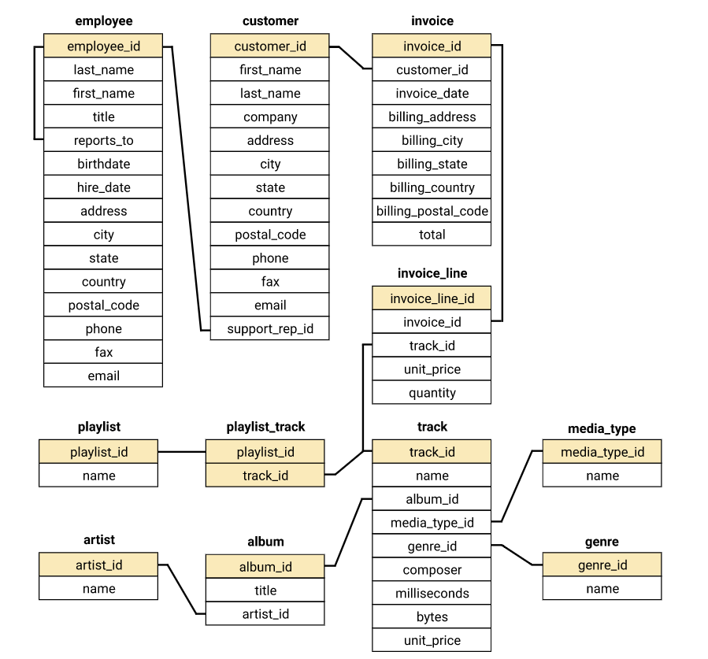

# Answering Business Questions using SQL

## Introduction and Schema Diagram

In this Project "Answering Business Questions using SQL.ipynb" notebook, we will be using the [Chinook](https://github.com/lerocha/chinook-database) Database to answer some business questions using SQL. The Chinook data model represents a fictional digital media store, including tables for artists, albums, media tracks, invoices and customers based on real data from an iTunes Library and manually generated data. The database is provided as a SQLite database file called `chinook.db`.
 
 

    
Why the name Chinook?

    The name of this sample database was based on the Northwind database. <a href="http://en.wikipedia.org/wiki/Chinook_wind" title="Chinook Wind">Chinooks</a> are winds in the interior West of North America, where the Canadian Prairies and Great Plains meet various mountain ranges. Chinooks are most prevalent over southern Alberta in Canada. Chinook is a good name choice for a database that intents to be an alternative to Northwind.

Before we dive into it, let's take a look at the database schema.

**There are 11 tables in the Chinook database.**

1. **employee** table stores employees data such as employee id, last name, first name, etc. It also has a field named reports_to to specify who reports to whom.
2. **customer** table stores customers data.
3. **invoice** table stores invoice header data.
4. **invoice_line** table stores the invoice <u title="The term “line item” refers to any service or product added to an invoice, along with any quantities, rates, and prices that pertain to them.">line items data</u>.
5. **artist** table stores artists data. It is a simple table that contains only artist_id and name.
6. **album** table stores data about a list of tracks. Each album belongs to one artist. However, one artist may have multiple albums.
7. **media_type** table stores media types such as MPEG audio and AAC audio file.
8. **genre** table stores music types such as rock, jazz, metal, etc.
9. **track** table store the data of songs. Each track belongs to one album.
10. **playlist** table store data about playlists. Each playlist contains a list of tracks. Each track may belong to multiple playlists. The relationship between the playlist table and track table is <u title="A many-to-many relationship refers to a relationship between tables in a database when a parent row in one table contains several child rows in the second table, and vice versa.">many-to-many</u>.
11. **playlist_track** table is used to reflect this relationship.

## Business Questions

To learn more about the Chinook database, we will answer some business questions of the like:
- Generating a query that finds the most popular genre in order for the marketing team to select the albums to purchase to generate profit.
- Analyse which sales agent performs the best
- Generate a query that collates data on purchases from different countries and make a recommendation on which country to select for promotions and to generate profits.
- And more questions.